## ■サービス概要
このアプリは、「甘さ」に特化した、自分に合う"ちょうどいい甘さ"の商品と出会えるレビューサービスです。甘さ感覚チャートや「あまピタ度(=自分の甘さ感覚にどれだけ“ピタッと”ハマったかを5段階で設定)」で商品を評価でき、感覚の近い人のレビューを参考にすることで自分にぴったりの商品が見つかります。
また、「甘さ感覚診断」により自分の好みの甘さの傾向が分かるほか、自分と似た甘さ感覚を持つ人とつながることで、選ぶ楽しさも広がります。

## ■ このサービスへの思い・作りたい理由
甘すぎるものが苦手な自分自身の経験から、「ちょうどいい甘さ」に出会えない不便さや、周囲と同じように楽しめない寂しさを感じてきました。これまではパッケージ情報と過去の記憶を頼りに、「自分に合う甘さかどうか」をひとりで判断するしかなく、新しいものにチャレンジしづらい場面が多くありました。このサービスでは、甘さの感覚が近い人のレビューや体験を共有することで、自分に合う甘さと出会い、自分らしく甘さを楽しめる居場所を目指しています。

## ■ ユーザー層について
- 甘すぎるものが苦手だけれど、甘いものを楽しみたい人
  - 自分と似た甘さ感覚を持つ人のレビューを参考にすることで、安心して新しい商品にチャレンジでき、甘いものを楽しむ幅が広がる。
- 30代以降で甘すぎるものが負担に感じるようになった人
    - 年齢とともに甘さを重く感じるようになっても、無理なく楽しめる“ちょうどいい甘さ”に出会うことで、甘いものを楽しむ時間が心地よいものになる。
- 健康志向で、甘さを控えた選択をしたい人
    - 血糖値や甘味の依存性への配慮から、“甘さ控えめでも満足できる選択”をしたいと考えており、健康的な習慣をストレスなく続けるヒントが得られる。

## ■ サービスの利用イメージ
- 甘さ感覚診断
  - メジャーな甘い商品に対する感じ方や好みに関する簡単な質問に答えることで、好みの甘さ感覚を5項目( 1.甘さの強さ 2.後味のキレ／すっきり感 3.自然な甘さ 4.爽快感 5.甘さの深み/コク)のレーダーチャートで可視化します。さらに、診断結果から「さっぱり自然派」「濃厚ロマン派」などの甘さタイプを判定しプロフィールに登録されます。似た甘さ感覚を持つユーザーのレビューには「甘さ感覚ツイン」などのラベルが表示されるため、自分に合った商品が見つけやすくなります。
- あまピタ評価
  - 商品に対する甘さ感覚を5項目で評価すると、甘さ感覚チャートが自動生成されます。甘さの感覚を「記録」として残すことで、自分の好みを再確認したり、新しい商品を選ぶ際の判断材料として活用できます。
- あまピタ評価一覧
  - 投稿の概要（平均甘さ感覚チャート・各ユーザーのあまピタ評価・コメント）を一覧で確認できます。各ユーザーのレビュー詳細では個別の甘さ感覚チャートを見ることができ、コメント欄で甘さの感じ方や共感ポイントを言葉で共有できます。味覚をめぐる会話が、レビューをより深く楽しむきっかけになります。
- Xシェア機能
  - 診断結果やレビューをシェアすることで、自分と似た甘さ感覚を持つ人がサービスに参加するきっかけになります。また、甘さの感じ方を共有することで「ちょうどいい甘さ」を大切にするコミュニティが広がっていきます。
## ■ サービスの差別化ポイント・推しポイント
- 「甘さ」にフォーカスしているところ
  - 多くのレビューサービスが「美味しい／美味しくない」や「コスパ」といった広い評価軸を持つ中で、このサービスは「甘さ」に特化しているのが大きな特長です。甘さ感覚診断や5つの項目によるレーダーチャート・あまピタ度によって、甘さ感覚の違いによる迷いや失敗のリスクを減らし、自分に合った甘さに出会いやすくなります。

- 甘さ感覚が近い人ベースのおすすめ一覧機能
  - 似た甘さ感覚を持つユーザーのあまピタ度をもとに商品が推薦されるため、不安なく新しい商品にチャレンジできます。主観的な甘さの感覚を“自分に近い感覚の人”を通して確かめられることで、レビューの信頼性が高まり、選ぶ楽しさも広がります。

## ■ 機能候補
### MVP
- ユーザー登録・ログイン
- 甘さ感覚診断
  - レーダーチャート
  - 甘さタイプ
- プロフィール
- 投稿
  - 編集・削除
  - レーダーチャート
    - 元となる5項目のレート
  - あまピタ度(レート)
- 投稿一覧
  - ユーザーの平均甘さ感覚チャート
  - 各ユーザーのあまピタ度
  - コメント(20文字程度を表示)
- 投稿詳細
  - 甘さ感覚チャート
  - コメント(全文を表示)
- Xシェア機能(診断結果)

### 本リリース
- パスワードリセット機能
- プロフィール
  - バッジ機能
  - 公開・非公開
- 投稿
  - カテゴリ
  - 公開・非公開
- 投稿一覧
  - ユーザー別の甘さ感覚チャート
- おすすめ一覧(甘さ感覚が似たユーザーのあまピタ度が高い商品)
- 投稿詳細
  - いいねボタン
  - ブックマーク
  - コメント機能
  - ユーザー詳細
- 投稿検索
  - 複数条件
  - フリーワード
- 通知機能
- Xシェア機能(商品レビュー)
- 独自ドメイン
- お問い合わせ
- 利用規約
- プライバシーポリシー

## ■ 機能の実装方針予定
- ユーザー認証機能
  - Devise
- 外部ログイン機能
  - OmniAuth
- Xシェア機能
  - MiniMagick
- 画像投稿
  - ActiveStorage
- オートコンプリート機能
  - stimulus-autocomplete
- 公開・非公開機能
  - Pundit

## 技術スタック
- Rails7系
- Tailwind CSS / DaisyUI
- Chart.js
- PostgreSQL
- Render

## ER図

```mermaid
erDiagram
    users {
        bigint id PK "ID"
        int sweetness_type_id "甘さタイプID"
        string name "ユーザー名"
        string email "メールアドレス"
        text self_introduction "自己紹介文"
        string encrypted_password "パスワード（暗号化）"
        string reset_password_token "パスワードリセット用トークン"
        datetime reset_password_sent_at "リセットメール送信日時"
        datetime remember_created_at "自動ログイン設定日時"
        string provider "外部ログインのサービス名（Google）"
        string uid "外部サービス上のユーザーID" 
        datetime created_at "作成日時"
        datetime updated_at "更新日時"
    }

    posts {
        bigint id PK "ID"
        int user_id FK "ユーザーID"
        string product_name "商品名"
        string manufacture "メーカー名"
        int sweetness_rating "あまピタ度"
        text review "商品の感想"
        datetime created_at "作成日時"
        datetime updated_at "更新日時"
    }

    post_categories {
        bigint id PK "ID"
        int post_id FK "投稿ID"
        int category_id FK "カテゴリーID"
        datetime created_at "作成日時"
        datetime updated_at "更新日時"
    }

    categories {
        bigint id PK "ID"
        string name "カテゴリー名"
        datetime created_at "作成日時"
        datetime updated_at "更新日時"
    }

    post_sweetness_scores {
        bigint id PK "ID"
        int post_id FK "対象の投稿ID"
        int sweetness_strength "甘みの強さ"
        int aftertaste_clarity "後味のキレ/スッキリ感"
        int natural_sweetness "自然な甘さ"
        int coolness "爽快感"
        int richness "甘さの深み/コク"
        datetime created_at "作成日時"
        datetime updated_at "更新日時"
    }

    likes {
        bigint id PK "ID"
        int user_id FK "いいねをしたユーザーID"
        int post_id FK "対象の投稿ID"
        datetime created_at "作成日時"
        datetime updated_at "更新日時"
    }

    comments {
        bigint id PK "ID"
        int user_id FK "コメントをしたユーザーID"
        int post_id FK "対象の投稿ID"
        text body "コメント本文"
        datetime created_at "作成日時"
        datetime updated_at "更新日時"
    }

    bookmarks {
        bigint id PK "ID"
        int user_id FK "ブックマークしたユーザーID"
        int post_id FK "対象の投稿ID"
        datetime created_at "作成日時"
        datetime updated_at "更新日時"
    }

    sweetness_types {
        bigint id PK "ID"
        string name "甘さタイプ名"
        datetime created_at "作成日時"
        datetime updated_at "更新日時"
    }

    sweetness_profiles {
        bigint id PK "ID"
        int user_id FK "ユーザーID"
        int sweetness_strength "甘みの強さ"
        int aftertaste_clarity "後味のキレ/スッキリ感"
        int natural_sweetness "自然な甘さ"
        int coolness "爽快感"
        int richness "甘さの深み/コク"
        datetime created_at "作成日時"
        datetime updated_at "更新日時"
    }
    user_badges {
        bigint id PK "ID"
        int user_id FK "ユーザーID"
        int badge_id FK "バッジID"
        datetime created_at "作成日時"
        datetime updated_at "更新日時"
    }

    badges {
        bigint id PK "ID"
        string badge_name "バッジ名"
        int badge_category "バッジの種類"
        int threshold "条件値"
        datetime created_at "作成日時"
        datetime updated_at "更新日時"
    }

    notifications {
        bigint id PK "ID"
        int sender_id FK "アクションしたユーザー"
        int recipient_id FK "通知を受け取るユーザー"
        int notifiable_id "対象のいいね/コメントのID"
        string notifiable_type "通知対象のモデル名（Like/Comment）"
        string action "通知アクション（liked/commented）"
        bool checked "既読の確認（default false）"
        datetime created_at "作成日時" 
        datetime updated_at "更新日時"
    }

    %% === ユーザー関連 ===
    users }o--|| sweetness_types : "多:1"
    users ||--|| sweetness_profiles : "1:1"
    users ||--o{ posts : "1:多"
    
    %% === ユーザーの実績・評価関連 ===
    users ||--o{ user_badges : "1:多"
    badges ||--o{ user_badges : "1:多"
    
    %% === 投稿・評価・カテゴリ関連 ===
    posts ||--|| post_sweetness_scores : "1:1"
    posts ||--o{ post_categories : "1:多"
    categories ||--o{ post_categories : "1:多"

    %% === ユーザーのアクション（いいね・コメント・通知・ブックマーク） ===
    users ||--o{ likes : "1:多"
    users ||--o{ comments : "1:多"
    users ||--o{ bookmarks : "1:多"
    users ||--o{ notifications : "1:多"

    posts ||--o{ likes : "1:多"
    posts ||--o{ comments : "1:多"
    posts ||--o{ bookmarks : "1:多"
```

## 画面遷移図
Figma : https://www.figma.com/design/uazJL21GsNpMCUUzhGqWgm/amapita?node-id=0-1&t=1M7LZzFet88AITvi-1