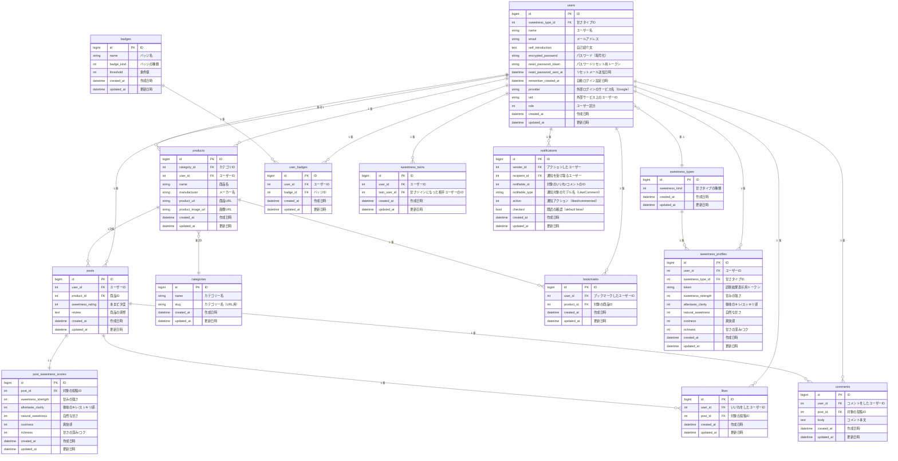

# あまピタッ！
🔗 **サービスURL** : https://amapita.com/

📝 **Qiita記事**：[【個人開発】好みの甘さ感覚が近いユーザーと繋がることで、"ちょうどいい甘さ"に出会えるアプリを作りました](https://qiita.com/yu3589/items/2623c497665c9529a951)

## 🍰 サービス概要
このアプリは、「甘さ」に特化した、自分に合う"ちょうどいい甘さ"の商品と出会えるレビューサービスです。  
甘さ感覚チャートや「あまピタ度(=自分の甘さ感覚にどれだけ“ピタッと”ハマったかを5段階で評価)」で商品を評価でき、感覚の近い人のレビューを参考にすることで自分にぴったりの甘さの商品が見つかります。
また、「甘さ感覚診断」により自分の好みの甘さの傾向が分かるほか、「甘さツイン(=好みの甘さ感覚が近い人)」とつながることで、選ぶ楽しさも広がります。

## 💬 このサービスへの思い・作りたい理由
甘すぎるものが苦手な自分自身の経験から、「ちょうどいい甘さ」に出会えない不便さや、周囲と同じように甘いものを楽しめない寂しさを感じてきました。
甘さの感じ方は人それぞれですが、私は水ですら甘く感じるものがあるほど甘さに対して敏感です。
そのため、パッケージ表記や他人のおすすめだけでは、自分に合う甘さかどうかを判断しづらく、新しい商品に挑戦しにくいと感じていました。
このサービスでは、甘さの感覚が近い人のレビューを通じて、ユーザーが自分に合った甘さの商品と出会い、甘いものをより楽しめる体験を提供したいと考え、開発しました。

## 👥 ユーザー層について
- 甘すぎるものが苦手だけれど、甘いものを楽しみたい人
  - 自分と似た甘さ感覚を持つ人のレビューを参考にすることで、  
  安心して新しい商品にチャレンジでき、甘いものを楽しむ幅が広がる。
- 30代以降で甘すぎるものが負担に感じるようになった人
  - 年齢とともに甘さを重く感じるようになっても、  
  無理なく楽しめる“ちょうどいい甘さ”に出会うことで、甘いものを楽しむ時間が心地よいものになる。

## 🍫 サービスの利用イメージ
### ⭐️ 誰でも利用できる機能

| 甘さ感覚診断 | 投稿一覧 |
| :---: | :---: |
|  |  |
| 甘さの感じ方や甘さの好みに関する質問から、ユーザーの甘さ傾向タイプを診断します。 また、診断結果から甘さツイン(=好みの甘さ感覚が近いユーザー)を判定します。 <small>※ 甘さツインの判定にはログインが必要。</small> | ユーザーの投稿をまとめて確認できます。 「みんなの甘さ評価」「甘さツインのあまピタ評価」の2つのタブがあり、タブごとに検索が可能です。 <small>※「あまピタ評価」： レビュー時に設定する5段階評価のうち、 「ちょうどいい甘さ」と判定されたもの。</small> |

| 商品一覧 | 商品詳細 |
| :---: | :---: |
|  |  |
| 
「○人中○人があまピタッ!」という形式で、 あまピタ評価の人数を一覧で確認できます。 カテゴリ別での閲覧も可能です。 | 
商品に対するレビューをまとめて確認できます。 平均評価と自己評価のチャートの色が分かれているため、 甘さの感じ方の違いを楽しめます。 <small>※ 投稿にはログインが必要です。</small>
 |

### ✨ ログイン後に利用できる機能
| 新規商品登録・レビュー投稿 | 既存商品へのレビュー投稿 |
| :---: | :---: |
|  |  |
| 「商品情報の登録」と「評価部分」に分かれており、 評価は公開・非公開を選択できます。 | すでに登録されている商品であれば、 商品情報を入力せずにレビューのみを投稿できます。 |

| マイページ | ブックマーク・通知 |
| :---: | :---: |
|  |  |
| 最新の甘さ感覚診断の結果及び 自分の投稿・いいねした投稿を一覧で確認できます。 | ブックマークした商品は一覧で確認でき、いいね・コメントは通知で受け取れます。 |

## ✅ サービスの差別化ポイント・推しポイント

### 1. 「甘さ」に特化したレビュー体験
多くのレビューサービスが「美味しい／美味しくない」や「コスパ」といった広い評価軸を持つ中で、このサービスは「甘さ」に特化しているのが大きな特長です。甘さ感覚診断で判定される"甘さツイン"や5つの項目によるレーダーチャート・あまピタ度によって、甘さ感覚の違いによる迷いや失敗のリスクを減らし、自分に合った甘さに出会いやすくなります。

### 2. 甘さツインの「あまピタ評価」で安心してチャレンジできる
似た甘さ感覚を持つユーザー「甘さツイン」の"ちょうどいい甘さ"と評価した商品が表示されるため、不安なく新しい商品にチャレンジできます。主観的な甘さの感覚を"自分に近い感覚の人"を通して確かめられることで、レビューの信頼性が高まり、選ぶ楽しさも広がります。

## 💡 技術的な工夫・こだわりポイント

### 1. 投稿へのハードルを下げるUI設計
既存の商品であれば、レビュー時に商品情報を入力する必要はありません。
あまピタ度と甘さ評価を登録するだけで、商品情報が自動的に投稿へ反映されます。

**工夫した点:**
- 「あまピタ判定する」ボタンからすぐにレビュー画面へ遷移可能
- 「楽天で検索」ボタンから商品情報を取得できるため、商品画像の準備やカテゴリ・メーカーの入力が不要

| 既存商品へのレビュー投稿| 新規商品登録・レビュー投稿 |
| :---: | :---: |
|  |  |

### 2. 「甘さツイン」判定ロジックの実装
甘さ感覚診断の診断結果から、ユーザー間の相性を数値化し、好みの甘さ感覚が近いユーザーを「甘さツイン」として判定するアルゴリズムを実装しました。

アルゴリズムの特徴:
- 「甘みの強さ」「後味のキレ/スッキリ感」を必須条件(±1以内)として設定
- 5項目の総合スコアが4以内であれば甘さツインと判定
- 複数のテストユーザーで検証し、「感覚の近さ」を感じられる基準になるよう設計

📝 **詳細な設計理由はこちら**  
👉 [【個人開発】好みの甘さ感覚が近いユーザーと繋がることで、"ちょうどいい甘さ"に出会えるアプリを作りました](https://qiita.com/yu3589/items/2623c497665c9529a951)

### 3. レーダーチャートの実装
商品詳細画面では、平均評価と自己評価のチャートの色が分かれているため、甘さの感じ方の違いを楽しめます。

工夫した点:
- Chart.jsを使用し、レビューユーザーの平均チャートとログインユーザーのチャートを1つのレーダーチャートに重ねて表示
- チャートが重なっても独立して見えるよう透明度と色味を調整
- スマホでも見やすいレスポンシブ対応を実装

## ■ 機能候補
### MVP
- ユーザー登録・ログイン
- Googleログイン認証
- 診断機能
- 投稿一覧画面
- 投稿の新規登録・編集・削除
- 投稿詳細画面
- 静的OGP

### 本リリース
- パスワードリセット機能
- バッジ機能
- 投稿の非公開機能
- オートコンプリート
- 甘さツインのあまピタ評価
- ブックマーク機能
- いいね機能
- コメント機能
- 通知機能
- 投稿・商品検索機能
- 動的OGP
- ローディングアニメーション
- 独自ドメイン
- お問い合わせ
- 利用規約
- プライバシーポリシー

## ■ 今後の機能拡張予定
- 商品一覧・各カテゴリ一覧での並び替え機能（商品登録順、あまピタ評価順など）
- 通知機能の拡充（甘さツインの新規投稿通知など）
- 過去の診断結果一覧（自分の甘さ感覚の変化を振り返る)

## 使用した技術
|カテゴリ| 使用技術 |
|:------------:|:------------:|
| フロントエンド       | TailwindCSS / daisyUI / Chart.js / Alpine.js / Javascript      |
| バックエンド     | Ruby 3.3.6 / Rails 7.2.1      |
| インフラ       | Render / AWS S3(画像保存) / Cloudinary(動的OGP画像生成)        |
| データベース         | PostgreSQL         |
| 認証       | Devise / OmniAuth      |
| 開発環境       | Docker      |
| API    | 楽天API     |

### 主要なGem
| Gem | 用途 |
|:------------:|:------------:|
| stimulus-autocomplete | 検索候補表示 |
| pagy | ページネーション |
| ransack | 検索機能 |
| ActiveStorage | 画像アップロード |
| Swiper | スライダー |
| draper | プレゼンテーション層の実装：画像表示ロジック |
| solid_queue | 楽天APIを利用した商品情報取得処理の非同期実行 |
| meta-tags | OGP設定 |

## ER図

## 画面遷移図
Figma : https://www.figma.com/design/uazJL21GsNpMCUUzhGqWgm/amapita?node-id=0-1&t=1M7LZzFet88AITvi-1